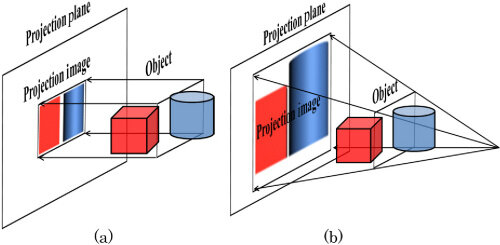
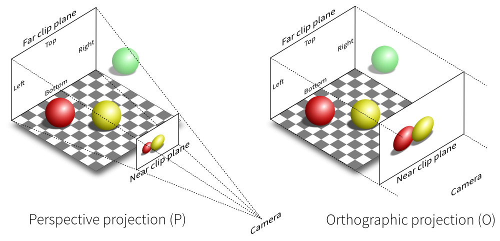

### Introduction to 3D Projection

3D projection refers to methods that map three-dimensional points onto a two-dimensional plane, like a screen. There are two main types of projections: Orthographic and Perspective.

### Orthographic Projection

Orthographic projection is a type of parallel projection where all projection lines are perpendicular (orthogonal) to the projection plane. This results in every plane of the scene appearing without any perspective distortion on the viewing surface.

- **Orthographic Camera:** A camera that captures scenes using orthographic projection.
- **Clipping Planes:**
  - **Left, Right:** Define the horizontal boundaries of the viewing frustum, which is the 3D volume in space that the camera can capture. The left and right planes determine the width of the frustum.
  - **Bottom, Top:** Define the vertical boundaries of the viewing frustum. The bottom and top planes determine the height of the frustum.
  - **Near, Far:** Define the depth range or distance from the camera within which objects are rendered. The near plane is the closest distance from the camera where objects start to appear, and the far plane is the furthest distance where objects are still visible.

In matrix form, the orthographic projection matrix adjusts the current transformation matrix \( M \) with the following matrix:

  

### Perspective Projection

Perspective projection mimics how the human eye perceives depth. Distant objects appear smaller, creating a sense of depth and realism.

- **Perspective Camera:** A camera that uses perspective projection.
- **Field of View (FOV):** Determines how wide the view angle is.
- **Near Plane:** The closest distance from the camera where objects start to be rendered.
- **Far Plane:** The furthest distance where objects are still rendered.

The perspective projection requires greater definition. The camera's position, orientation and field of view. Assuming the eye is located at (0,0,0) and (left(l), bottom(b), -near(-n)) & (right(r), top(t), -near) specify the lower-left & upper-right points on the near clipping plane and -f specifying the location of far clipping plane, the perspective projection matrix is  

 
 

**Below are two images that clearly show the differences between them-**

<strong>1. Orthographic vs Perspective Projection</strong>

 
 
 

<strong>2. Perspective vs Orthographic Projection</strong>

  

 

 ## Conclusion

- **Perspective Camera:** Objects closer to the camera appear larger, while objects further away appear smaller. This effect mimics human perception of depth and distance, creating a sense of realism.
  
- **Orthographic Camera:** Objects of the same dimension appear similar in size regardless of their distance from the camera. There is no size variation based on depth, resulting in a more uniform representation of the scene.

