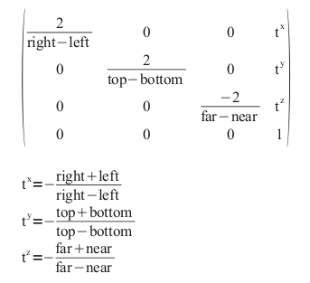

3D projection is any method of mapping three-dimensional points to a two-dimensional plane. There are 2 types of projections, Orthographic and Perspective.  

**Orthographic projection** is a form of parallel proection, where all the projection lines are orthogonal to the projection plane, resulting in every plane of the scene appearing in affine transformation on the viewing surface. An Orthographic camera captures the othographic projection of the points in the scene.  

An othographic camera, with left and right being vertical clipping planes, top and bottom being horizontal clipping planes, near and far being depth clipping planes, multiplies the current matrix M with the following matrix and replace the current matrix with the result.  

  

When a human eye looks at a scene, object in the distance appear smaller than objects close by - this is known as **Perspective projection**. Unlike orthographic projection, perspective projection shows distant objects as smaller to provide additional realism.  

The perspective projection requires greater definition. The camera's position, orientation and field of view. Assuming the eye is located at (0,0,0) and (left, bottom, -near) & (right, top, -near) specify the lower-left & upper-right points on the near clipping plane and -f specifying the location of far clipping plane, the perspective projection matrix is  

